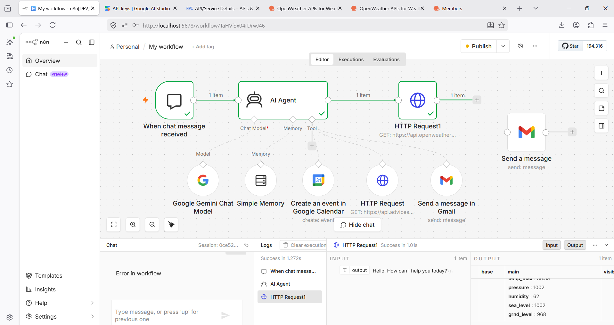

# 🤖 AI Personal Assistant using n8n

An AI-powered personal assistant workflow built using **n8n**, **Google Gemini AI**, **Google Calendar**, **Gmail**, and **OpenWeather API**.

## 🚀 Features

- 📅 Create Google Calendar events using natural language
- 📧 Send emails through Gmail
- 🌤️ Get real-time weather information
- 🧠 AI-powered responses using Google Gemini
- 💾 Memory support for conversations
- ⚡ Automated workflows using n8n

## 🛠️ Technologies Used

- n8n
- Google Gemini API
- Google Calendar API
- Gmail API
- OpenWeather API

## 📂 Project Files

- `My workflow.json` – Complete n8n workflow

## ▶️ How to Use

1. Import `My workflow.json` into n8n.
2. Configure your API credentials.
3. Connect Google Calendar and Gmail.
4. Add your Gemini API Key.
5. Execute the workflow.

## 🔮 Future Improvements

- WhatsApp Integration
- Telegram Bot
- Voice Assistant
- Task Management
- News API
- Expense Tracker

## 👨‍💻 Author

**Ansh Thakare**

## 📸 Workflow Screenshot

